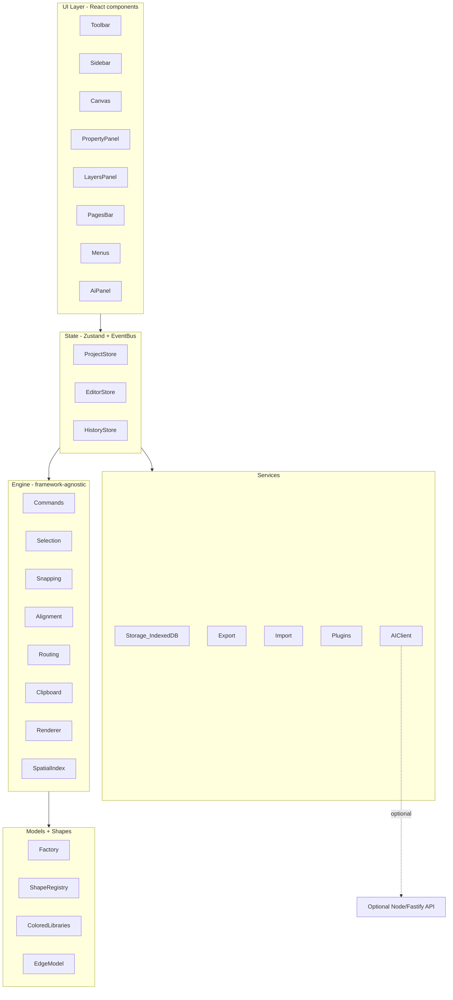

# Architecture

DiagramForge is a layered, framework-agnostic editor. React renders the UI, but
all editing logic lives in an independent engine so it can be tested and reused
without the DOM.

## Layers

1. **UI (`components/`, `app/`)** — presentational React components. They read
   from stores and dispatch engine actions; they contain no business logic.
2. **State (`state/`)** — three Zustand stores plus a typed Event Bus:
   - `projectStore` — the persisted document (project, pages, shapes, edges).
   - `editorStore` — ephemeral UI state (camera, tool, selection, panels).
   - `historyStore` — undo/redo stacks (Command pattern).
3. **Engine (`engine/`)** — pure modules for commands, selection/hit-testing,
   snapping, alignment, connector routing, clipboard, the spatial index, and
   rendering geometry. No React imports.
4. **Domain (`models/`, `shapes/`, `types/`)** — the `Shape`/`Edge`/`Page`/
   `Project` models, factories with defaults, and the shape/library registry.
5. **Services (`services/`)** — IndexedDB storage, export, import, the plugin
   registry, and the AI client. These are the only modules that touch the
   network or browser storage.

## Patterns

- **Command pattern** — every mutation runs through `historyStore.run()` so it
  is reversible (see [history](history.md)).
- **Observer pattern** — a typed `EventBus` (`utils/eventBus.ts`) decouples
  engine/services from components (e.g. `export:request`, `ai:open`, `toast`).
- **Registry / plugin** — shapes, libraries, and plugin contributions register
  themselves at startup (see [plugin API](plugin-api.md)).
- **Dependency direction** — UI → state → engine → domain. Services are invoked
  from state/UI. Nothing in the engine or domain imports React.

## Offline-first

The app never requires a backend. Autosave persists to IndexedDB; libraries and
favorites use localStorage; AI generation degrades to an offline heuristic
generator. The optional backend only adds provider-backed AI and project sync.
