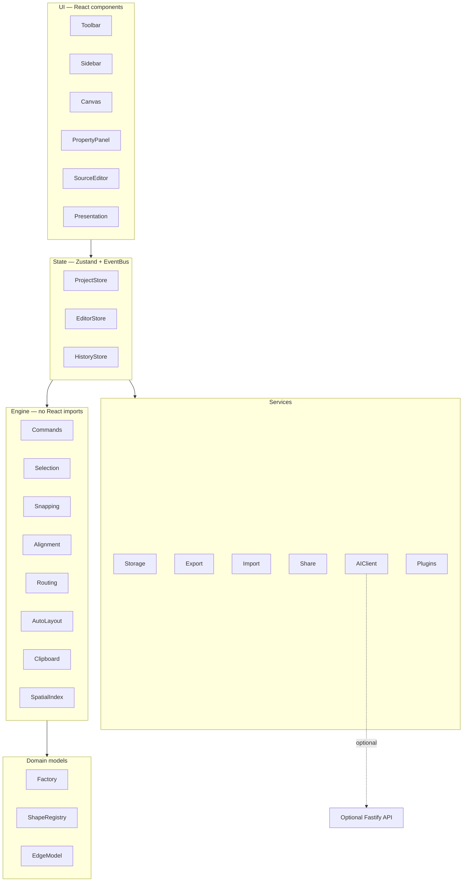

# DiagramForge Developer Guide

Complete reference for contributors and integrators: what the app does, how it
is built, where the code lives, and how each major feature works.

**Repository:** [github.com/samba425/Udraw](https://github.com/samba425/Udraw)  
**Author:** samba425 — [asiva325@gmail.com](mailto:asiva325@gmail.com)  
**License:** MIT

---

## Table of contents

1. [Overview](#overview)
2. [Tech stack](#tech-stack)
3. [Architecture](#architecture)
4. [Repository layout](#repository-layout)
5. [Data model & file format](#data-model--file-format)
6. [Feature catalog](#feature-catalog)
7. [How subsystems work](#how-subsystems-work)
8. [Development setup](#development-setup)
9. [Scripts & testing](#scripts--testing)
10. [Deployment (Docker)](#deployment-docker)
11. [Security & hardening](#security--hardening)
12. [Extending the editor](#extending-the-editor)
13. [Related documentation](#related-documentation)

---

## Overview

**DiagramForge** (also referred to as **Udraw** in the GitHub repo) is an
offline-first, open-source diagram editor — a draw.io / Lucidchart /
Excalidraw alternative. It uses a **custom SVG rendering engine** (not a third-party
diagram SDK).

Design goals:

- **No login, no cloud account, no paid SDKs**
- **100% functional in the browser** without a backend
- **Strict TypeScript** — no `any`, framework-agnostic engine layer
- **Accessible** — keyboard shortcuts, ARIA where applicable
- **Scalable** — quadtree spatial index + viewport culling for 10,000+ nodes

Optional backend adds AI diagram generation and project sync; the editor degrades
gracefully when it is unavailable.

---

## Tech stack

### Frontend

| Layer | Technology | Version (approx.) |
| --- | --- | --- |
| UI framework | React | 19 |
| Language | TypeScript | 5.7 (strict) |
| Bundler / dev server | Vite | 7 |
| Styling | Tailwind CSS | 4 |
| State | Zustand | 5 |
| Routing | React Router | 7 |
| Forms | React Hook Form | 7 |
| Animation | Motion (Framer Motion) | 11 |
| Icons | Lucide React | — |
| IDs | nanoid | 5 |
| YAML parsing | js-yaml | 5 |
| PDF export | jsPDF | 4 |
| ZIP export | JSZip | 3 |
| PWA | vite-plugin-pwa | 1 |
| IndexedDB | idb | 8 |

**Rendering strategy:** SVG-first for shapes and connectors; HTML overlays for
in-place text editing; HTML5 Canvas only for raster export (PNG/PDF).

### Backend (optional)

| Layer | Technology |
| --- | --- |
| Runtime | Node.js ≥ 22 |
| HTTP server | Fastify 5 |
| Validation | Zod 3 |
| Security | @fastify/helmet, @fastify/cors, @fastify/rate-limit |
| Dev runner | tsx |

### Testing & tooling

| Purpose | Tool |
| --- | --- |
| Unit / integration | Vitest 3 + React Testing Library |
| E2E | Playwright |
| Lint | ESLint 9 (flat config) |
| Format | Prettier |
| Containers | Docker multi-stage + docker-compose |

---

## Architecture

DiagramForge follows a **layered, clean architecture**. React renders UI; all
editing logic lives in an independent engine that can be tested without the DOM.



### Layers

| Layer | Path | Responsibility |
| --- | --- | --- |
| **UI** | `frontend/src/components/`, `app/` | Presentational React; reads stores, dispatches actions |
| **State** | `frontend/src/state/` | Zustand stores + typed Event Bus |
| **Engine** | `frontend/src/engine/` | Pure editing logic (commands, routing, layout, hit-testing) |
| **Domain** | `frontend/src/models/`, `types/`, `shapes/` | Shape/Edge/Page/Project models and registries |
| **Services** | `frontend/src/services/` | I/O: storage, import/export, share, AI client |
| **Backend** | `backend/src/` | Optional AI + project sync API |

### Patterns

- **Command pattern** — mutations run through `historyStore.run()` for undo/redo
- **Observer / Event Bus** — `utils/eventBus.ts` decouples UI from services
  (`export:request`, `ai:open`, `toast`, `zoom:fit`, …)
- **Registry / plugin** — shapes, libraries, and extensions register at startup
- **Dependency rule** — UI → state → engine → domain; engine never imports React

See also: [architecture.md](architecture.md), [state-management.md](state-management.md).

---

## Repository layout

```
drawIO/
├── frontend/          # Vite + React editor (primary app)
│   ├── src/
│   │   ├── app/           # Shell, routing, EditorLayout
│   │   ├── components/    # UI by feature (canvas, toolbar, source, …)
│   │   ├── hooks/         # Canvas interactions, shortcuts, autosave, files
│   │   ├── engine/        # Framework-agnostic editing core
│   │   ├── models/        # Factories (createShape, createEdge, …)
│   │   ├── shapes/        # Shape registry + colored libraries
│   │   ├── services/      # Storage, import/export, share, AI, source editor
│   │   ├── state/         # Zustand stores
│   │   ├── plugins/       # Plugin registry + built-ins
│   │   ├── templates/     # Starter diagram templates
│   │   ├── themes/        # Light/dark/system CSS variables
│   │   ├── types/         # Domain TypeScript types
│   │   └── utils/         # Geometry, event bus
│   └── e2e/               # Playwright specs
├── backend/           # Optional Fastify service
│   └── src/
│       ├── ai/            # Heuristic + provider-backed generation
│       ├── routes/        # health, ai, projects
│       └── diagramSpec.ts # Shared zod schema
├── docker/            # Dockerfiles + nginx config
├── docs/              # Documentation (this file + subsystem docs)
└── docker-compose.yml
```

**Path alias:** `@/` → `frontend/src/`  
**Conventions:** co-located `*.test.ts` files; engine/domain modules never import React.

Full tree: [folder-structure.md](folder-structure.md).

---

## Data model & file format

### Core types

| Type | Description |
| --- | --- |
| `Project` | Root document: name, pages, assets, theme, settings |
| `Page` | One canvas slide: shapes map, edges map, layer list, z-order |
| `Layer` | Named group; shapes/edges belong to a layer |
| `Shape` | Rectangle, ellipse, icon, text, swimlane, image, pen path, … |
| `Edge` | Connector between two endpoints (shape anchors or floating points) |

Types live in `frontend/src/types/`. Factories in `frontend/src/models/factory.ts`.

### On-disk format

Native format: **JSON** (`.dgm.json` recommended extension).

```json
{
  "app": "diagramforge",
  "version": 1,
  "project": { "id": "...", "name": "...", "pages": [...], "assets": [] }
}
```

- Envelope signature: `diagramforge` (`FILE_SIGNATURE`)
- `parseProject()` accepts both enveloped and bare project objects
- YAML and Mermaid are **views** of the same data (source editor), not separate
  native formats on disk

Implementation: `frontend/src/services/project/fileFormat.ts`.

### Edge model highlights

| Field | Purpose |
| --- | --- |
| `router` | `straight` \| `orthogonal` \| `curved` \| `bezier` |
| `startArrow` / `endArrow` | `none` \| `arrow` \| `triangle` \| `diamond` \| `circle` |
| `source` / `target` | `{ shapeId, anchor? }` or `{ point }` |
| `waypoints` | Manual routing control points |
| `label` | Text label rendered at path midpoint |

---

## Feature catalog

Every user-facing capability, grouped by area.

### Canvas & navigation

| Feature | User action | Key files |
| --- | --- | --- |
| Infinite canvas | Pan (hand tool / middle mouse), scroll to zoom | `editorStore.ts`, `Canvas.tsx` |
| Grid & snap | Toggle grid; shapes snap to grid and each other | `engine/snapping/` |
| Smart guides | Alignment guides while dragging | `engine/snapping/guides.ts` |
| Minimap | Toggle minimap; click to jump | `components/canvas/Minimap.tsx` |
| Fit to screen | `Shift+1` or toolbar | `editorStore.fitToBounds()` |
| In-diagram search | `Mod+F` | `components/canvas/DiagramSearch.tsx` |
| Themes | Light / dark / system | `themes/`, CSS variables |

### Tools

| Tool | Shortcut | Description |
| --- | --- | --- |
| Select | `V` | Move, resize, rotate, multi-select, marquee |
| Pan (hand) | `H` | Pan without selecting |
| Rectangle | `R` | Draw rectangle |
| Ellipse | `O` | Draw ellipse |
| Diamond | `D` | Draw diamond |
| Text | `T` | Place editable text |
| Connector | `C` | Draw edges between shapes |
| Sticky note | `N` | Colored sticky note |
| Pen | `P` | Freehand path |
| Eraser | `E` | Delete shapes by dragging over them |
| Image | — | Import image as shape |

Tool IDs: `frontend/src/types/index.ts` (`ToolId`).  
Interaction state machine: `frontend/src/hooks/useCanvasInteractions.ts`.

### Shape libraries

Sidebar categories (searchable, favorites, drag-and-drop):

| Category | Content |
| --- | --- |
| Basic | Rectangles, circles, lines, arrows |
| Flowchart | Start/end, process, decision, data, … |
| UML | Class, actor, use case, … |
| BPMN | Tasks, gateways, events |
| AWS | EC2, S3, Lambda, RDS, VPC, … |
| Azure | VM, Storage, Functions, AKS, … |
| Kubernetes | Pod, Service, Deployment, … |
| Network | Router, switch, firewall, cloud, … |
| Mind Map | Central topic, branch nodes |
| Org Chart | Person / role cards |
| Sticky Notes | Colored note tiles |
| Icons | General-purpose glyphs |
| Custom SVG | Runtime from imported SVG files |
| Favorites | User-pinned icons (localStorage) |

Registration: `frontend/src/shapes/libraries/index.ts`.

### Connectors

| Feature | How it works |
| --- | --- |
| Magnetic anchors | Purple dots on hover/select; drag to connect |
| Router types | Straight, orthogonal (default), curved, bezier |
| Anchor pairing | Auto bottom→top for org charts; manual anchor on drag |
| Orthogonal routing | Exit/entry stubs + 90° segments (`engine/routing/edgePath.ts`) |
| Arrow styles | Triangle, open arrow, diamond, circle markers |
| Dashed / animated lines | `dash` style + CSS stroke animation |
| Labels | Text at path midpoint |
| Reconnect | Drag endpoint handles to reattach |

### Editing & layout

| Feature | User action | Key files |
| --- | --- | --- |
| Undo / redo | `Mod+Z` / `Mod+Shift+Z` | `state/historyStore.ts`, [history.md](history.md) |
| Clipboard | Copy, cut, paste, duplicate | `engine/clipboard/` |
| Group / ungroup | `Mod+G` / `Mod+Shift+G` | `engine/commands/actions.ts` |
| Align & distribute | Toolbar / context menu | `engine/alignment/` |
| Auto layout | Toolbar button | `engine/layout/autoLayout.ts` |
| Format painter | Pick style → click shapes to apply | `engine/commands/formatPainter.ts` |
| Hyperlinks | URL in property panel; Ctrl+Click opens | `types/shape.ts`, PropertyPanel |
| Swimlanes | Insert 3-lane pool | `engine/commands/swimlane.ts` |

### Pages & layers

| Feature | Description |
| --- | --- |
| Multiple pages | Tab bar; duplicate, rename, delete |
| Page thumbnails | Preview in pages bar |
| Layers | Create, rename, lock, hide, reorder, nest |
| Z-order | Bring forward / send backward |

### Source editor (JSON / YAML / Mermaid)

| Mode | Shortcut | Description |
| --- | --- | --- |
| Canvas only | Default | Visual editor |
| Source only | `Mod+Shift+J` | Full-screen text editor |
| Split view | `Mod+Shift+K` | Canvas + source side by side |

Formats (`SourceFormat`):

| Format | Serialize | Apply to canvas |
| --- | --- | --- |
| JSON | Full project envelope | `parseProject()` |
| YAML | Project via js-yaml dump/load | Round-trip through JSON |
| Mermaid | Active page flowchart DSL | `services/mermaid/pageMermaid.ts` |

Implementation: `frontend/src/services/sourceEditor.ts`,  
UI: `frontend/src/components/source/SourceEditorPanel.tsx`.

### Import

| Format | Entry point | Notes |
| --- | --- | --- |
| JSON (`.dgm.json`) | File menu / drop | Native project format |
| PNG / images | Drop on canvas | Creates `image` shape |
| SVG | Drop / import | Sanitized; can register as library icon |
| draw.io XML | Drop / import | XXE-hardened `mxGraph` parser |
| Mermaid | Plugin / paste in source | Flowchart syntax → shapes + edges |
| PlantUML | Plugin (`.puml`) | Activity diagram subset + auto layout |

Import dispatch: `frontend/src/services/import/index.ts`.

### Export

| Format | Pipeline |
| --- | --- |
| SVG | `serializeSvg.ts` — standalone SVG with markers |
| PNG | SVG → Canvas rasterization at 2× scale |
| PDF | PNG embedded in jsPDF (avoids vulnerable svg2pdf chain) |
| JSON | `serializeProject()` |
| ZIP | Project JSON + per-page SVG/PNG previews (JSZip) |
| Mermaid | Plugin exporter — active page to `flowchart` DSL |

Export is triggered via Event Bus `export:request`; handled in `hooks/useFileActions.ts`.

### Sharing & view-only mode

| Mode | URL hash | Behavior |
| --- | --- | --- |
| Editable share | `#d=<base64url-json>` | Full editor |
| View-only share | `#dv=<base64url-json>` | Pan/zoom only; `readOnly=true` |

No server required — entire project encoded in the URL fragment (size limits apply).

Implementation: `frontend/src/services/share/urlShare.ts`.

### Templates & welcome

| Template | Category | Contents |
| --- | --- | --- |
| Flowchart | Flowchart | Start → process → decision → end |
| AWS 3-tier | Architecture | Users, CDN, LB, compute, DB |
| Org chart | Org | CEO, managers, team members |
| Sprint retro | Whiteboard | Three sticky-note columns |

Gallery: `frontend/src/templates/index.ts`. Welcome dialog offers recovery +
template picker on startup.

### Presentation mode

| Action | Behavior |
| --- | --- |
| `F5` or Present button | Fullscreen slideshow |
| Arrow keys / click | Navigate pages as slides |
| Escape | Exit presentation |

Each slide auto-fits page content to viewport.  
Implementation: `frontend/src/components/presentation/PresentationMode.tsx`.

### AI diagram generation (optional)

| Mode | When |
| --- | --- |
| Offline heuristic | No backend / provider failure |
| Provider (OpenAI-compatible) | `AI_PROVIDER` + `AI_API_KEY` configured on backend |

Flow: prompt → `DiagramSpec` (zod) → `buildDiagram()` → shapes + edges on canvas.

Frontend: `frontend/src/services/ai/`  
Backend: `backend/src/routes/ai.ts`, `backend/src/ai/`

### Persistence & PWA

| Feature | Mechanism |
| --- | --- |
| Autosave | IndexedDB every ~3 s (debounced) |
| Crash recovery | Restore last project on startup (unless share URL) |
| Save As | Download `.dgm.json` |
| PWA install | `vite-plugin-pwa` — standalone mode, offline asset cache |
| Favorites | localStorage for pinned library icons |

Autosave: `frontend/src/hooks/useAutosave.ts`  
Storage: `frontend/src/services/storage/db.ts`

### Plugins (built-in)

| Plugin | Purpose |
| --- | --- |
| `diagramStats` | Count shapes/edges; toast + shortcut |
| `mermaidImport` | Import `.mmd` / Mermaid text |
| `mermaidExport` | Export page as Mermaid |
| `plantumlImport` | Import `.puml` activity diagrams |

Registry: `frontend/src/plugins/registry.ts`  
API: [plugin-api.md](plugin-api.md).

---

## How subsystems work

### Canvas interactions

`useCanvasInteractions.ts` implements a pointer **state machine**:

```
idle → move | resize | rotate | create | connect | reconnect | pen | erase | pan | marquee
```

- World coordinates computed from camera transform
- Connect mode: drag from anchor dot → hit-test target → `createEdge()`
- All mutations go through `historyStore.run()` for undo support

### Connector routing

1. **Resolve endpoints** — anchor on shape border, or auto-pair (bottom→top for
   vertical layouts)
2. **Route** — orthogonal paths use exit stubs + Manhattan segments
3. **Render** — `EdgeView.tsx` draws path + SVG markers (`refX` aligned to arrow tip)

Files: `engine/routing/anchors.ts`, `engine/routing/edgePath.ts`,  
`components/canvas/EdgeView.tsx`.

### Undo / redo

Every document mutation wraps in a reversible command:

```ts
history.run('Move shapes', () => project.updateShape(id, patch));
```

Stacks live in `historyStore`; `history.begin()` / `commit()` / `cancel()` for
drag batches.

### Auto layout

Hierarchical top-to-bottom layout:

1. Build adjacency from edges
2. Assign levels (longest path from roots)
3. Position nodes on a grid with spacing constants

Used by toolbar, context menu, Mermaid import, and PlantUML import.  
File: `engine/layout/autoLayout.ts`.

### Performance

| Technique | Purpose |
| --- | --- |
| Quadtree spatial index | Fast hit-testing and viewport queries |
| Viewport culling | Skip rendering off-screen shapes |
| Memoized shape views | Reduce React re-renders |

Files: `engine/spatial/`, [performance.md](performance.md).

### State stores

| Store | Persists? | Holds |
| --- | --- | --- |
| `projectStore` | Yes (IndexedDB) | Document: pages, shapes, edges |
| `editorStore` | No | Camera, tool, selection, panels, viewMode, readOnly |
| `historyStore` | No | Undo/redo stacks |
| `libraryStore` | Partial (favorites) | Sidebar search, pinned icons |

---

## Development setup

### Prerequisites

- **Node.js 22+**
- **npm**

### Frontend (required)

```bash
cd frontend
npm install
npm run dev        # http://localhost:5173
```

The editor runs fully offline. No backend needed.

### Backend (optional)

```bash
cd backend
npm install
npm run dev        # http://localhost:8787
```

Point frontend at backend:

```bash
cd frontend
VITE_API_BASE_URL=http://localhost:8787 npm run dev
```

Without `VITE_API_BASE_URL`, AI uses the offline heuristic generator.

### Environment variables

| Variable | Where | Purpose |
| --- | --- | --- |
| `VITE_API_BASE_URL` | Frontend build | Backend API base URL |
| `VITE_API_TARGET` | Vite dev proxy | Proxy target for `/api` (default `localhost:8080`) |
| `GITHUB_PAGES` | Frontend build | Set `true` for `/drawIO/` base path |
| `AI_PROVIDER` | Backend | e.g. `openai` |
| `AI_API_KEY` | Backend | Provider key (server-side only) |
| `AI_MODEL` | Backend | e.g. `gpt-4o-mini` |
| `CORS_ORIGIN` | Backend | Allowed frontend origin(s) |

---

## Scripts & testing

### Frontend (`cd frontend`)

| Script | Description |
| --- | --- |
| `npm run dev` | Vite dev server |
| `npm run build` | Type-check + production bundle (+ PWA service worker) |
| `npm run preview` | Preview production build |
| `npm run lint` | ESLint |
| `npm run typecheck` | `tsc --noEmit` |
| `npm test` | Vitest unit/integration |
| `npm run test:e2e` | Playwright (builds first) |

### Backend (`cd backend`)

| Script | Description |
| --- | --- |
| `npm run dev` | Fastify with hot reload |
| `npm run build` | Compile to `dist/` |
| `npm start` | Run compiled server |
| `npm test` | API tests |

### Recommended CI check

```bash
cd frontend && npm run lint && npm run typecheck && npm test
cd backend  && npm run typecheck && npm test
```

E2E (install browsers once: `npx playwright install`):

```bash
cd frontend && npm run test:e2e
```

---

## Deployment (Docker)

```bash
docker compose up --build
```

| Service | URL | Notes |
| --- | --- | --- |
| Frontend (nginx) | http://localhost:8080 | Serves static bundle |
| Backend (Fastify) | http://localhost:8080/api | Proxied through nginx |

Optional PostgreSQL (future sync):

```bash
docker compose --profile db up --build
```

Container hardening: non-root users, read-only root FS, dropped capabilities,
`no-new-privileges`, health checks.

AI in Docker:

```bash
export AI_PROVIDER=openai
export AI_API_KEY=sk-...
export AI_MODEL=gpt-4o-mini
docker compose up --build
```

---

## Security & hardening

| Area | Measure |
| --- | --- |
| XML import (draw.io) | Reject DTDs/entities; DOMParser only |
| SVG import | Strip scripts, events, dangerous URIs |
| Backend | Helmet, CORS allow-list, rate limiting, 5 MB body limit |
| Secrets | Never in frontend bundle; `AI_API_KEY` server-side only |
| Share URLs | Client-side only; no server persistence of shared data |
| Containers | Non-root, read-only FS, cap_drop ALL |

Import details: [export-import.md](export-import.md)  
Backend API: [backend-api.md](backend-api.md).

---

## Extending the editor

See **[embed-package.md](embed-package.md)** for using DiagramForge as `@diagramforge/react`
in other React applications.

### Add a plugin

```ts
import { pluginManager } from '@/plugins/registry';

pluginManager.register({
  id: 'my.plugin',
  name: 'My Plugin',
  version: '1.0.0',
  activate(ctx) {
    ctx.registerCommand({ id: 'my.cmd', title: 'Do thing', run: () => { /* … */ } });
    ctx.registerToolbarItem({ id: 'my.btn', title: 'Do thing', command: 'my.cmd' });
  },
});
```

Register in `plugins/index.ts` → `registerBuiltinPlugins()`.

### Add a shape library icon

Add tiles in `frontend/src/shapes/libraries/<category>.ts` and include them in
`libraries/index.ts`.

### Add an importer / exporter

Implement `ImporterContribution` or `ExporterContribution` in a plugin, or
extend `services/import/index.ts` / `services/export/index.ts`.

Full API: [plugin-api.md](plugin-api.md).

---

## Related documentation

| Document | Topic |
| --- | --- |
| [architecture.md](architecture.md) | Layer diagram and patterns |
| [folder-structure.md](folder-structure.md) | Full `src/` tree |
| [state-management.md](state-management.md) | Zustand stores in detail |
| [shape-model.md](shape-model.md) | Shape kinds and properties |
| [rendering.md](rendering.md) | SVG rendering pipeline |
| [history.md](history.md) | Undo/redo command pattern |
| [export-import.md](export-import.md) | File formats and sanitization |
| [performance.md](performance.md) | Spatial index and culling |
| [plugin-api.md](plugin-api.md) | Extension API |
| [backend-api.md](backend-api.md) | REST endpoints |
| [keyboard-shortcuts.md](keyboard-shortcuts.md) | Shortcut reference |

---

## Design principles

SOLID · DRY · KISS · composition over inheritance · Command + Observer patterns ·
strict TypeScript · accessible · offline-first · zero paid dependencies.

When adding features:

1. Keep business logic out of React components
2. Route mutations through the history store
3. Add co-located tests for engine/services code
4. Sanitize all untrusted imports (SVG, XML)
5. Prefer client-side processing; backend optional

---

*Last updated: July 2026 — DiagramForge v0.1.0*
